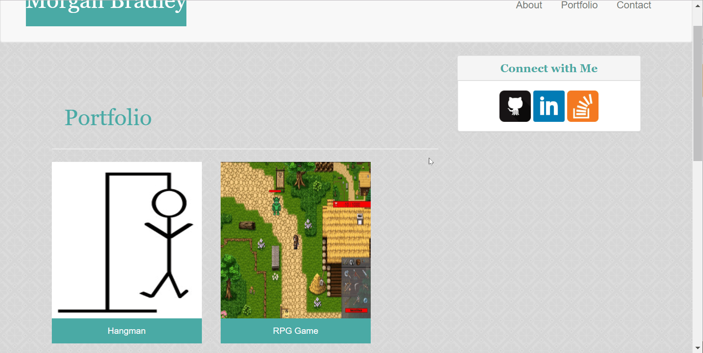

# Bootstrap-Portfolio

This project expands upon the Basic-Portfolio and the Responsive-Portfolio projects by using **HTML**, **CSS**, and **Bootstrap** to create an innately responsive web design. The design uses the Bootstrap grid, NavBar, input form, buttons, and panels. 

Each page includes an **animation** that is applied to one element using the **@keyframes rule**. This rule binds an animation to an element and declares styling for each step of the animation (0% complete, 50% complete, etc.) Please check out the gifs below to see them in action!

#### About Me Page - Image Animation

#### Portfolio Page - Connect with Me Panel Animation

#### Contact Page - Submit Button Animation
